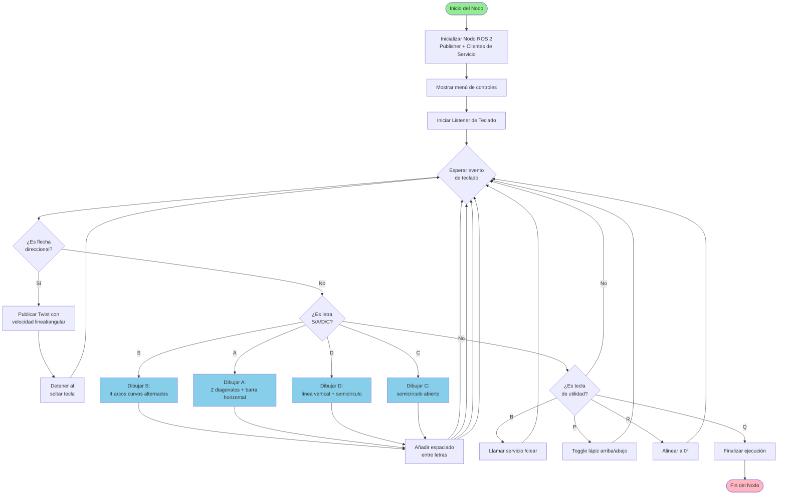

<div align="center">
  
</div>

---

> **Resumen:** Laboratorio del curso *Robótica de Desarrollo* enfocado en el aprendizaje de **ROS 2 Humble** mediante el simulador **Turtlesim**. Se implementa un nodo en Python que permite controlar la tortuga con el teclado y dibujar automáticamente las iniciales de los integrantes del equipo (S, A, D, C).

---

## 🧾 Autores

- **Samuel David Sanchez Cardenas** — Desarrollo del nodo, implementación de letras y documentación.  
  [](https://github.com/samsanchezcar)
- **Santiago Ávila** — Diseño de trayectorias, pruebas y documentación.  
  [](https://github.com/Santiago-Avila)

---

## 📂 Estructura del repositorio

```text
ROS2-Humble-Turtlesim/
├── Laboratorio_No__04___2025_II___Robótica_de_Desarrollo__Intro_a_ROS__Copy_.pdf
├── README.md
└── ros2_ws/
    ├── build/
    ├── install/
    ├── log/
    └── src/
        └── my_turtle_controller/
            ├── my_turtle_controller/
            │   ├── __init__.py
            │   └── move_turtle.py
            ├── package.xml
            ├── resource/
            ├── setup.cfg
            ├── setup.py
            └── test/
```

---

## 📋 Tabla de Contenidos

1. [Introducción](#introducción)  
2. [Objetivos](#objetivos)  
3. [Requisitos previos](#requisitos-previos)  
4. [Instalación y configuración](#instalación-y-configuración)  
5. [Funcionalidades implementadas](#funcionalidades-implementadas)  
6. [Arquitectura del sistema](#arquitectura-del-sistema)  
7. [Diagrama de flujo](#diagrama-de-flujo)  
8. [Diseño de las letras](#diseño-de-las-letras)  
9. [Uso del sistema](#uso-del-sistema)  
10. [Resultados](#resultados)  
11. [Conclusiones](#conclusiones)  
12. [Referencias](#referencias)  

---

## 📖 Introducción

**ROS 2 (Robot Operating System 2)** es un framework de código abierto para el desarrollo de software robótico que proporciona herramientas, bibliotecas y convenciones para simplificar la creación de aplicaciones robóticas complejas.

Este laboratorio introduce los conceptos fundamentales de ROS 2 mediante **Turtlesim**, un simulador didáctico que permite:

- Comprender la arquitectura de nodos, tópicos y servicios de ROS 2
- Practicar comandos básicos de Linux
- Implementar nodos personalizados en Python
- Controlar robots mediante teclado
- Desarrollar algoritmos de trayectorias geométricas

El proyecto implementa un controlador de tortuga que:

1. **Permite movimiento manual** mediante flechas del teclado
2. **Dibuja automáticamente** las letras S, A, D, C (iniciales de los integrantes)
3. **Gestiona el control del lápiz** (levantar/bajar)
4. **Incluye funciones auxiliares** (borrar pantalla, reset de orientación)

---

## 🎯 Objetivos

### Objetivos generales

- Conocer y explicar los conceptos básicos de ROS 2 (nodos, tópicos, servicios, mensajes)
- Utilizar los comandos fundamentales de Linux para el desarrollo en ROS 2
- Conectar nodos de ROS 2 con Python mediante publicadores y clientes de servicios

### Objetivos específicos

- Implementar un nodo de control que publique en el tópico `/turtle1/cmd_vel`
- Utilizar servicios de ROS 2 (`/clear`, `/turtle1/set_pen`) para control del simulador
- Capturar eventos de teclado y traducirlos a comandos de movimiento
- Diseñar algoritmos geométricos para dibujar letras personalizadas
- Gestionar el estado interno del robot (orientación, posición del lápiz)
- Documentar el desarrollo siguiendo estándares profesionales

---

## 📚 Requisitos previos

### Software necesario

- **Ubuntu 22.04 LTS** (recomendado para ROS 2 Humble)
- **ROS 2 Humble Hawksbill** instalado
- **Python 3.10+**
- **Git** para control de versiones

### Conocimientos requeridos

- Comandos básicos de Linux (navegación, permisos, edición de archivos)
- Conceptos de programación orientada a objetos en Python
- Nociones de geometría para cálculo de trayectorias
- Familiaridad con el terminal de Linux

### Tutoriales previos

Es altamente recomendable haber completado:

- [Intro Linux](https://github.com/labsir-un/ROB_Intro_Linux.git)
- [Intro ROS 2 Humble](https://github.com/labsir-un/ROB_Intro_ROS2_Humble.git)
- [Intro Turtlesim](https://github.com/labsir-un/ROB_Intro_ROS2_Humble_Turtlesim.git)

---

## 🔧 Instalación y configuración

### 1. Instalación de ROS 2 Humble

Si aún no tienes ROS 2 Humble instalado, sigue la [guía oficial](https://docs.ros.org/en/humble/Installation.html):

```bash
# Configurar locale
sudo apt update && sudo apt install locales
sudo locale-gen es_ES es_ES.UTF-8
sudo update-locale LC_ALL=es_ES.UTF-8 LANG=es_ES.UTF-8
export LANG=es_ES.UTF-8

# Añadir repositorio de ROS 2
sudo apt install software-properties-common
sudo add-apt-repository universe
sudo apt update && sudo apt install curl -y
sudo curl -sSL https://raw.githubusercontent.com/ros/rosdistro/master/ros.key -o /usr/share/keyrings/ros-archive-keyring.gpg
echo "deb [arch=$(dpkg --print-architecture) signed-by=/usr/share/keyrings/ros-archive-keyring.gpg] http://packages.ros.org/ros2/ubuntu $(. /etc/os-release && echo $UBUNTU_CODENAME) main" | sudo tee /etc/apt/sources.list.d/ros2.list > /dev/null

# Instalar ROS 2 Humble
sudo apt update
sudo apt install ros-humble-desktop
```

### 2. Instalación de Turtlesim

```bash
sudo apt install ros-humble-turtlesim
```

### 3. Instalación de dependencias de Python

```bash
pip install pynput
```

### 4. Configuración del workspace

```bash
# Clonar el repositorio
git clone <URL_DEL_REPOSITORIO>
cd ROS2-Humble-Turtlesim/ros2_ws

# Compilar el workspace
source /opt/ros/humble/setup.bash
colcon build

# Configurar el entorno
source install/setup.bash
```

### 5. Verificación de la instalación

```bash
# Terminal 1: Ejecutar Turtlesim
ros2 run turtlesim turtlesim_node

# Terminal 2: Listar nodos activos
ros2 node list
# Salida esperada: /turtlesim
```

---

## ⚙️ Funcionalidades implementadas

### 1. Control manual de movimiento

El nodo responde a las **flechas del teclado** para mover la tortuga:

| Tecla | Acción |
|-------|--------|
| ↑ | Avanzar hacia adelante (velocidad lineal positiva) |
| ↓ | Retroceder (velocidad lineal negativa) |
| ← | Girar a la izquierda (velocidad angular positiva) |
| → | Girar a la derecha (velocidad angular negativa) |

**Implementación:**

```python
def on_key_press(self, key):
    msg = Twist()
    
    if key == keyboard.Key.up:
        msg.linear.x = self.lin_speed
    elif key == keyboard.Key.down:
        msg.linear.x = -self.lin_speed
    elif key == keyboard.Key.left:
        msg.angular.z = self.ang_speed
    elif key == keyboard.Key.right:
        msg.angular.z = -self.ang_speed
    
    self.publisher_.publish(msg)
```

### 2. Dibujo automático de letras

Se implementaron funciones para dibujar las iniciales del equipo:

- **Tecla S**: Dibuja la letra S (Samuel / Sanchez)
- **Tecla A**: Dibuja la letra A (Ávila)
- **Tecla D**: Dibuja la letra D (David)
- **Tecla C**: Dibuja la letra C (Cardenas)

Cada letra se diseñó considerando:

- **Geometría precisa**: Uso de ángulos, arcos y líneas rectas
- **Continuidad del trazo**: Movimientos fluidos sin saltos bruscos
- **Espaciado automático**: Separación entre letras para evitar superposiciones
- **Retorno a orientación base**: Finalización alineada horizontalmente

### 3. Funciones auxiliares

| Tecla | Función | Descripción |
|-------|---------|-------------|
| B | Borrar pantalla | Limpia todos los trazos del simulador |
| P | Toggle lápiz | Alterna entre lápiz arriba (no dibuja) y abajo (dibuja) |
| R | Reset orientación | Alinea la tortuga a 0° (horizontal derecha) |
| Q | Salir | Finaliza la ejecución del nodo |

### 4. Gestión del estado interno

El nodo mantiene un estimado de:

- **Orientación actual** (`self.theta`): Actualizada tras cada rotación
- **Estado del lápiz** (`self.pen_is_up`): Controla si la tortuga dibuja o no
- **Parámetros de velocidad**: Configurables para ajustar la suavidad del trazo

---

## 🏗️ Arquitectura del sistema

### Componentes de ROS 2

```mermaid
graph TB
    A[move_turtle.py<br/>TurtleController Node]
    B[turtlesim_node<br/>Simulator]
    C[/turtle1/cmd_vel<br/>Topic: Twist]
    D[/clear<br/>Service: Empty]
    E[/turtle1/set_pen<br/>Service: SetPen]
    
    A -->|Publica mensajes Twist| C
    C -->|Suscrito| B
    A -.->|Llama servicio| D
    A -.->|Llama servicio| E
    D -.->|Ejecuta| B
    E -.->|Ejecuta| B
    
    style A fill:#a8e6cf
    style B fill:#ffd3b6
    style C fill:#ffaaa5
    style D fill:#ff8b94
    style E fill:#ff8b94
```

### Descripción de componentes

**Nodos:**

- **TurtleController** (`move_turtle.py`): Nodo personalizado que captura eventos de teclado y envía comandos
- **turtlesim_node**: Simulador gráfico que renderiza la tortuga y procesa comandos de movimiento

**Tópicos:**

- `/turtle1/cmd_vel` (geometry_msgs/Twist): Transmite velocidades lineales y angulares

**Servicios:**

- `/clear` (std_srvs/Empty): Borra los trazos de la pantalla
- `/turtle1/set_pen` (turtlesim/SetPen): Configura color, grosor y estado del lápiz

---

## 📊 Diagrama de flujo



---

## 🎨 Diseño de las letras

### Letra A

**Estrategia geométrica:**

1. Alinear a 68° (diagonal izquierda ascendente)
2. Avanzar 1.1 segundos (pierna izquierda)
3. Rotar a -68° (diagonal derecha descendente)
4. Avanzar 1.1 segundos (pierna derecha)
5. Retroceder 50% para posicionar barra central
6. Girar 180° y trazar barra horizontal

```python
def draw_A(self):
    self._prepare_letter()
    
    angle_deg = 68
    angle_rad = math.radians(angle_deg)
    leg_duration = 1.1
    
    # Diagonal izquierda
    self.align_to_angle(angle_rad)
    self.move(self.lin_speed, 0.0, leg_duration)
    
    # Diagonal derecha
    self.align_to_angle(-angle_rad)
    self.move(self.lin_speed, 0.0, leg_duration)
    
    # Barra central
    self.move(-self.lin_speed, 0.0, leg_duration * 0.5)
    self.align_to_angle(math.pi)
    bar_width = (self.lin_speed * leg_duration * math.cos(angle_rad)) * 0.9
    self.move(self.lin_speed, 0.0, bar_width / self.lin_speed)
    
    self.add_spacing()
```

### Letra C

**Estrategia geométrica:**

Semicírculo abierto hacia la derecha

1. Posicionar en esquina superior derecha
2. Trazar línea horizontal corta hacia la izquierda
3. Arco grande de 180° con `arc(lin, ang, duration)`
4. Línea horizontal corta hacia la derecha

```python
def draw_C(self):
    self._prepare_letter()
    
    # Posicionar arriba-derecha
    self.pen(True)
    self.align_to_angle(math.pi / 2)
    self.move(self.lin_speed, 0.0, 1.0)
    self.align_horizontal()
    self.move(self.lin_speed, 0.0, 0.7)
    self.pen(False)
    
    # Parte superior
    self.align_to_angle(math.pi)
    self.move(self.lin_speed, 0.0, 0.15)
    
    # Arco principal
    self.arc(self.lin_speed, 1.8, 1.75)
    
    # Parte inferior
    self.align_horizontal()
    self.move(self.lin_speed, 0.0, 0.15)
    
    self.add_spacing()
```

### Letra D

**Estrategia geométrica:**

Línea vertical + semicírculo derecho cerrado

1. Línea vertical ascendente
2. Línea horizontal corta
3. Arco de 180° hacia abajo (angular negativo)
4. Cerrar con línea horizontal

```python
def draw_D(self):
    self._prepare_letter()
    
    # Línea vertical
    self.align_to_angle(math.pi / 2)
    self.move(self.lin_speed, 0.0, 1.0)
    
    # Parte superior
    self.align_horizontal()
    self.move(self.lin_speed, 0.0, 0.15)
    
    # Semicírculo
    self.arc(self.lin_speed, -1.8, 1.75)
    
    # Cerrar base
    self.align_to_angle(math.pi)
    self.move(self.lin_speed, 0.0, 0.15)
    
    self.add_spacing()
```

### Letra S

**Estrategia geométrica:**

Cuatro arcos alternados formando curva en S

1. Arco inferior derecho (subiendo)
2. Arco transición central (subiendo)
3. Arco transición superior (bajando)
4. Arco superior izquierdo (terminando)

```python
def draw_S(self):
    self._prepare_letter()
    
    s_lin = 1.0
    s_ang = 2.3
    
    # Curva inferior
    self.align_to_angle(math.radians(-30))
    self.arc(s_lin, s_ang, 1.0)
    
    # Transiciones
    self.arc(s_lin, s_ang, 0.5)
    self.arc(s_lin, -s_ang, 0.5)
    
    # Curva superior
    self.arc(s_lin, -s_ang, 1.0)
    
    self.add_spacing()
```

---

## 🚀 Uso del sistema

### Paso 1: Lanzar Turtlesim

En una terminal, ejecuta:

```bash
source /opt/ros/humble/setup.bash
ros2 run turtlesim turtlesim_node
```

Deberías ver una ventana con una tortuga en el centro.

### Paso 2: Lanzar el controlador

En **otra terminal**:

```bash
cd ~/Documents/Robotics/ROS/ROS2-Humble-Turtlesim/ros2_ws
source install/setup.bash
ros2 run my_turtle_controller move_turtle
```

Verás el menú de controles en la consola:

```
==================================================
TURTLE CONTROLLER - Controles:
  Flechas    → Mover tortuga
  A, C, D, S → Dibujar letras
  B          → Borrar pantalla
  P          → Toggle lápiz arriba/abajo
  R          → Reset orientación (0°)
  Q          → Salir
==================================================
```

### Paso 3: Interactuar con el sistema

**Movimiento manual:**

- Usa las flechas para mover la tortuga libremente
- La tortuga dibuja mientras se mueve (lápiz abajo por defecto)

**Dibujar letras:**

1. Presiona `B` para limpiar la pantalla
2. Presiona `S` para dibujar la letra S
3. Presiona `A` para dibujar la letra A (con espaciado automático)
4. Presiona `D` para dibujar la letra D
5. Presiona `C` para dibujar la letra C

**Funciones auxiliares:**

- `P`: Levantar/bajar lápiz (útil para reposicionar sin dibujar)
- `R`: Realinear a 0° si la orientación se desincroniza
- `Q`: Cerrar el nodo correctamente

---

## 📈 Resultados

### Video demostrativo

<div align="center">

[](https://youtu.be/Oz1bQBVWLgo)

**([https://youtu.be/Oz1bQBVWLgo](https://youtu.be/Oz1bQBVWLgo))** — Demostración completa del sistema

</div>

### Funcionalidades validadas

✅ **Control manual**: La tortuga responde correctamente a las flechas del teclado  
✅ **Dibujo de letras**: Todas las letras (S, A, D, C) se trazan con precisión geométrica  
✅ **Espaciado automático**: Las letras no se superponen entre sí  
✅ **Control del lápiz**: Toggle funciona correctamente para mover sin dibujar  
✅ **Reset de orientación**: La función de alineación corrige desviaciones acumuladas  
✅ **Limpieza de pantalla**: El servicio `/clear` se ejecuta sin errores  

### Observaciones técnicas

**Precisión de orientación:**

La tortuga mantiene un estimado interno del ángulo (`self.theta`) que se actualiza tras cada movimiento angular. Para trayectorias largas o complejas, pequeños errores de integración numérica pueden acumularse. La función `align_to_angle()` mitiga este problema realineando activamente a ángulos conocidos.

**Suavidad del trazo:**

El uso de `time.sleep(0.02)` en el loop de publicación (50 Hz) garantiza un trazo continuo y fluido sin sobrecargar el sistema.

**Robustez del código:**

- Manejo de excepciones en el listener de teclado
- Detención segura al soltar flechas (`on_key_release`)
- Verificación de disponibilidad de servicios antes de llamarlos

---

## 🎓 Conclusiones

1. **ROS 2 como framework:** La arquitectura de nodos, tópicos y servicios de ROS 2 permite modularizar aplicaciones robóticas complejas en componentes reutilizables y desacoplados.

2. **Turtlesim como herramienta didáctica:** Aunque es un simulador simple, Turtlesim resulta extremadamente efectivo para comprender conceptos fundamentales de ROS 2 sin la complejidad de simuladores realistas.

3. **Importancia de la geometría:** El diseño de trayectorias precisas requiere dominio de trigonometría, cinemática y planificación de movimientos secuenciales.

4. **Gestión del estado interno:** Mantener un estimado de la orientación del robot es crítico para trayectorias complejas, especialmente cuando no se tiene acceso directo a odometría.

5. **Python + ROS 2:** La combinación de `rclpy` para ROS 2 y `pynput` para captura de teclado demuestra la versatilidad de Python para prototipado rápido en robótica.

6. **Documentación y control de versiones:** El uso de GitHub, diagramas Mermaid y READMEs estructurados es esencial para proyectos colaborativos y reproducibles.

7. **Aprendizaje práctico:** Este laboratorio sienta las bases para trabajar con robots reales, donde los mismos conceptos (publicadores, suscriptores, servicios) se aplican a sistemas móviles, manipuladores y drones.

---

## 📚 Referencias

1. Laboratorio No. 04 - Robótica de Desarrollo - Intro a ROS 2 Humble - Turtlesim. Universidad Nacional de Colombia, 2025.

2. Labsir UN - Intro Linux [Repositorio en GitHub]. Disponible en: [https://github.com/labsir-un/ROB_Intro_Linux.git](https://github.com/labsir-un/ROB_Intro_Linux.git)

3. Labsir UN - Intro ROS 2 Humble [Repositorio en GitHub]. Disponible en: [https://github.com/labsir-un/ROB_Intro_ROS2_Humble.git](https://github.com/labsir-un/ROB_Intro_ROS2_Humble.git)

4. Labsir UN - Intro Turtlesim [Repositorio en GitHub]. Disponible en: [https://github.com/labsir-un/ROB_Intro_ROS2_Humble_Turtlesim.git](https://github.com/labsir-un/ROB_Intro_ROS2_Humble_Turtlesim.git)

5. ROS 2 Humble Documentation. Disponible en: [https://docs.ros.org/en/humble/](https://docs.ros.org/en/humble/)

6. Introducing Turtlesim - ROS 2 Humble Tutorial. Disponible en: [https://docs.ros.org/en/humble/Tutorials/Beginner-CLI-Tools/Introducing-Turtlesim/Introducing-Turtlesim.html](https://docs.ros.org/en/humble/Tutorials/Beginner-CLI-Tools/Introducing-Turtlesim/Introducing-Turtlesim.html)

7. pynput Documentation. Disponible en: [https://pynput.readthedocs.io/](https://pynput.readthedocs.io/)

---

<div align="center">
  
</div>
